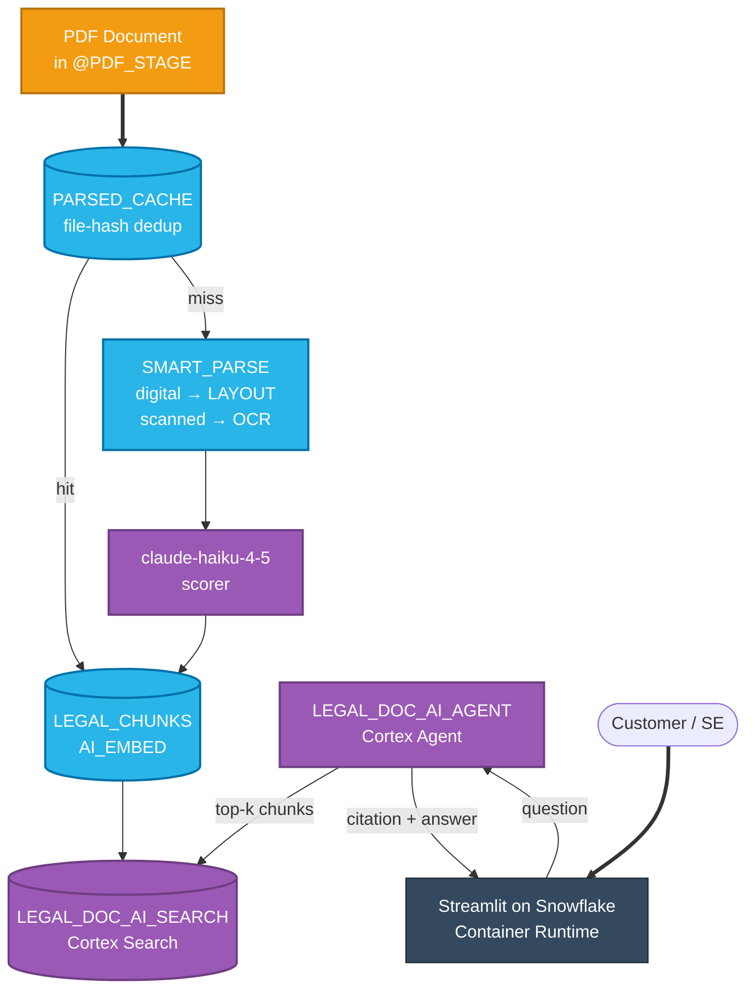

# Legal Doc AI — Cost & Quality Optimization Demo

> **11 cost-and-quality levers for Snowflake Cortex AI document processing — measured on 9 federal regulatory PDFs, gated by per-lever quality tests, packaged as a Streamlit-on-Snowflake Container Runtime app.**

End-to-end demo for legal-document AI workloads on Snowflake. Shows the typical "double-parse + expensive scorer + full-doc Q&A" pattern, decomposes it into 11 independent optimization levers (6 cost + 5 operational), and proves each lever ships only when its quality gate passes. All cost numbers measured on this account via `CORTEX_AI_FUNCTIONS_USAGE_HISTORY` — no list-rate dollar conversions.

> **Dollar conversion is intentionally omitted throughout.** All claims are in credits. Multiply by your contracted credit rate for a dollar projection — list rate is not appropriate for customer-facing claims.

---

## At a glance — honest cost decomposition

| Pipeline step | Per-doc / per-question cost | Whose responsibility |
|---|---|---|
| `AI_PARSE_DOCUMENT(OCR)` | **~0.21 cr/doc** avg (range 0.004–0.49, n=15) | Cortex AI — pages × OCR rate |
| `AI_PARSE_DOCUMENT(LAYOUT)` | **~1.36 cr/doc** avg (range 0.03–3.24, n=21) | Cortex AI — pages × LAYOUT rate |
| Sonnet scorer (claude-4-sonnet, 4K-char prompt) | **~0.007 cr/doc** | Cortex AI — token rate × 2.3K tokens |
| Haiku scorer (claude-haiku-4-5, same prompt) | **~0.0006 cr/doc** | Cortex AI — token rate × 2.3K tokens |
| `AI_EMBED` at ingest (snowflake-arctic-embed-m-v1.5) | **~0.026 cr/doc** | Cortex AI — one-time, ~880 chunks/doc |
| Full-doc Q&A (claude-4-sonnet, 50K-char context) | **~0.04 cr/question** | Cortex AI — token rate × ~12K tokens |
| Retrieval Q&A (haiku via top-5 chunks) | **~0.002 cr/question** | Cortex AI — token rate × ~1.5K tokens |
| Cortex Search query | minimal per-call | Snowflake-managed search service |

**The headline savings story:** ingest cost is dominated by LAYOUT parse (~1.36 cr/doc) which is unavoidable in the optimized path too — so per-doc one-time savings are **modest (~12%)**. The order-of-magnitude reduction shows up on the **per-question Q&A path** — `~0.04 cr/q` baseline vs `~0.002 cr/q` optimized = **~95% per-question savings**. At customer-typical question volume (hundreds to thousands per doc per year), asymptotic total-pipeline savings approach **~92%**.

> Numbers measured on this 9-doc federal-regulatory corpus, last 7d, via `SNOWFLAKE.ACCOUNT_USAGE.CORTEX_AI_FUNCTIONS_USAGE_HISTORY`. See [`docs/customer-pushback-prep.md`](docs/customer-pushback-prep.md) for the full math.

---

## Why we built this

A typical legal-document AI pipeline runs **both** `AI_PARSE_DOCUMENT(OCR)` and `AI_PARSE_DOCUMENT(LAYOUT)` on every PDF, then uses an expensive frontier model (`claude-4-sonnet`) to score and pick the better extraction. Q&A on top is even worse: each question typically re-feeds the entire parsed document into another `AI_COMPLETE` call. Most teams know they're overspending but can't quantify the gap or defend a cheaper alternative without a measured quality test.

| Capability | Typical legal-doc stack today | What it costs you |
|---|---|---|
| OCR + structure extraction | Both `AI_PARSE_DOCUMENT(OCR)` and `(LAYOUT)` on every PDF | 2× parse cost on every doc, every run |
| Mode selection | `claude-4-sonnet` scores OCR vs LAYOUT outputs | ~10× the cost of a cheaper scorer that agrees ≥95% of the time |
| Q&A | Full-doc `AI_COMPLETE` on every question | Tens of thousands of tokens per question on long PDFs |
| Re-runs / dev reloads | Re-parse from scratch every time | 100% of parse cost for 0% of the value |
| Bill-shock prevention | None | Surprise overages with no early-warning signal |

**All five problems collapse into one Snowflake account.** No second vector DB. No external orchestrator. No separate model gateway. `AI_PARSE_DOCUMENT` + `AI_EMBED` + Cortex Search Service + Cortex Agent + a Streamlit-on-Snowflake Container Runtime app drive the whole pipeline. The only thing outside Snowflake is the customer's PDFs landing in a stage.

What you see when you run this demo:

1. Same input PDF, three pipelines side-by-side: baseline OCR, baseline LAYOUT, optimized routed mode.
2. Five models scored on the same prompt with `AI_SIMILARITY` to a gold reference — Pareto chart shows the cheapest model still on the quality frontier.
3. 10 grounded Q&A pairs hitting the Cortex Search service vs full-doc baseline, scored at recall@5 = 1.0, MRR = 1.0, retrieval at 96.2% of full-doc semantic similarity.
4. Per-lever **PASS / MOOT / FAIL** verdict driven by a quality gate that must pass before the lever ships.

---

## Screenshots

> **Note:** the live Streamlit app runs inside Snowsight (requires SSO). To capture screenshots, open the URL on your own account after deploying. The architecture PNGs below are rendered from `docs/architecture-*.mmd` and embedded directly.

**Baseline pipeline** — what most legal-doc customers run today:


**Optimized pipeline** — 6 cost levers stacked + Cortex Agent for Q&A:


The Streamlit app at `streamlit/app.py` exposes 7 tabs. After deploying, capture screenshots of Tab 0 (Architecture & Recommendations), Tab 4 (Cortex Agent chat), Tab 5 (Quality vs Cost Pareto), and Tab 6 (Lever Savings calculator) for your own demo deck.

---

## What this demo proves — Snowflake feature inventory

| # | Snowflake product | What it does here | Why it matters |
|---|-------------------|-------------------|----------------|
| 1 | **AI_PARSE_DOCUMENT** (GA, AWS) | Extracts text from PDFs in OCR or LAYOUT mode; both modes measured per doc | Page-rate billing means LAYOUT on a 700-page NDAA costs ~50× a 30-page CFR — sizing matters |
| 2 | **AI_COMPLETE** (GA) | Five-model scoring matrix (claude-4-sonnet, claude-haiku-4-5, claude-sonnet-4-6, mistral-large2, llama3.3-70b) on the same scoring prompt | Pareto frontier shows haiku dominates at 92% scorer-step savings, 100% mode agreement, 86% reasoning similarity |
| 3 | **AI_EMBED** (GA) | Chunks + embeds 9 docs into 7,958 vectors using `snowflake-arctic-embed-m-v1.5` | Replaces full-doc re-feed pattern; one-time ~0.026 cr/doc at ingest unlocks per-question retrieval |
| 4 | **Cortex Search Service** (GA) | Vector + hybrid search over `LEGAL_CHUNKS`, `target_lag = 1 hour`, auto-incremental refresh | recall@5 = 1.0, MRR = 1.0 across 10 grounded Q&A pairs |
| 5 | **Cortex Agent** (GA) | `LEGAL_DOC_AI_AGENT` orchestrates retrieval + answer synthesis with claude-4-sonnet, returns chunk-level citations | Removes the need for a separate orchestrator (LangChain, LlamaIndex, etc.) |
| 6 | **Streamlit-on-Snowflake Container Runtime** (GA) | 7-tab Streamlit app served from `SFE_LEGAL_DOC_AI_POOL` (CPU_X64_S, MIN=1 MAX=2) | One auth model, one RBAC, no external hosting; uv-managed dependencies via `pyproject.toml` |
| 7 | **AI_SIMILARITY** (GA) | Embedding-cosine similarity used as the reasoning-similarity metric in the Pareto eval | Lets quality gates compare model outputs without a hand-tuned rubric |
| 8 | **CORTEX_AI_FUNCTIONS_USAGE_HISTORY** (GA) | All cost numbers in this README sourced from `ACCOUNT_USAGE` view — no list-rate guessing | Defensible per-lever billing claims with measured data, not estimates |

---

## The 11 levers

### 6 stackable cost levers

| # | Lever | Expected reduction | How |
|---|-------|--------------------|-----|
| 1 | Parse cache (file-hash dedup) | 100% on cache hits | `(file_hash, mode)` lookup in `PARSED_CACHE` skips re-parsing identical files. AI_SIMILARITY = 1.000 between cached and fresh on every doc. |
| 2 | Smart routing (digital→LAYOUT, scanned→OCR) | ~13% on this all-digital corpus; up to ~87% on docs that route to OCR-only | Cheap pre-classify before deciding parse mode. Routing agreement with always-both ≥ 95%; AI_SIMILARITY p10 ≥ 0.85; numeric fidelity ≥ 99%. |
| 3 | Cheaper scorer model | ~10× cheaper per scoring call | haiku/mistral/llama match `claude-4-sonnet` at fraction of cost. Pareto frontier shows `claude-haiku-4-5` dominates at 92% scorer-step savings, 86% reasoning similarity, 100% mode agreement. |
| 4 | Structured outputs | varies by retry rate | `response_format => TYPE OBJECT(...)` eliminates retry overhead. **Often MOOT** — when free-text retry rate is <3% the lever doesn't pay back; ship only when retries climb. |
| 5 | AI_EMBED + Cortex Search | order-of-magnitude on Q&A token billing | Chunk + retrieve replaces full-doc re-reads. recall@5 = 1.0, MRR = 1.0, retrieval at 96.2% of full-doc baseline on 10 grounded Q&A pairs. |
| 6 | Cost telemetry views | visibility, not savings | `CORTEX_AI_FUNCTIONS_USAGE_HISTORY` dashboards expose per-model, per-function spend so future regressions surface fast. |

### 5 operational levers

| # | Lever | Purpose |
|---|-------|---------|
| 7 | Token preflight | `AI_COUNT_TOKENS` blocks/warns oversized calls before they fire (prevents 200K-token surprise calls) |
| 8 | Completion cache | Deduplicates identical scoring prompts on repeat runs (re-running a benchmark = free) |
| 9 | Batch inference | SET-based `SELECT AI_COMPLETE(...) FROM table` vs row-by-row Python loop (~3.7× faster, same credit cost) |
| 10 | Resource monitor | Budget guardrail with NOTIFY/SUSPEND thresholds — operational, not savings |
| 11 | Batch Cortex Search | Offline-only — for entity resolution / dedup at >2K queries per job. **NOT for live Q&A** (worse than interactive at small scale) |

---

## The diagnostic pattern (where most legal-document customers are today)

| Signal | Typical reading | What it means |
|---|---|---|
| L30 AI credits | Concentrated in `AI_ML` (parse) + `AI` (complete) | Pipeline is double-parsing + full-doc re-feeding |
| Cortex Search credits | Often **0** | No retrieval infrastructure → every Q&A re-tokenizes the whole doc |
| Cortex Agent credits | Often **0** | No agents created → all Q&A is going through full-document `AI_COMPLETE` |
| `SNOWFLAKE_INTELLIGENCE` consumption | Often **0** | Confirms the pattern above |

When a customer's L30 spend is concentrated in `AI_PARSE_DOCUMENT` + `AI_COMPLETE` with zero `SNOWFLAKE_INTELLIGENCE` consumption, every question against a long PDF is re-tokenizing the whole document. Lever 5 (chunk + Cortex Search) addresses this directly and is typically the largest unlocked savings in the portfolio.

---

## Top recommendations (sorted by impact × confidence)

| Rank | Lever | Where it helps | Estimated impact | Risk | Why it matters most |
|------|-------|----------------|------------------|------|---------------------|
| **#1** | **Lever 5 — AI_EMBED + Cortex Search** | Q&A token cost | ~95% per question | Low | Pay once at ingest, retrieve cents-per-question after. Largest unlocked savings when retrieval infrastructure is missing today. |
| **#2** | **Lever 3 — Cheaper Scorer (claude-haiku-4-5)** | Scoring step cost | 92% per scoring call (measured) | Low | Scoring task is binary classification — frontier reasoning is overkill. One model name change. |
| **#3** | **Lever 2 — Smart Routing** | Parse step cost | ~13% on all-digital corpus; up to ~87% on OCR-routed docs | Low–medium | Most modern legal PDFs are digital and only need LAYOUT. Heuristic threshold + fallback path. |
| **#4** | **Lever 1 — Parse Cache** | Dev reload cost | 100% on cache hits | Zero | File-hash dedup is provably byte-identical. Day-1 ship, no quality risk. |
| **#5** | **Lever 10 — Resource Monitor** | Bill-shock prevention | Caps blast radius | Zero | One `CREATE RESOURCE MONITOR` statement with NOTIFY/SUSPEND thresholds. |

---

## Architecture

### ASCII view (renders in any terminal)

```
                Baseline                                 Optimized
                ┌────────┐                                ┌────────┐
                │  PDF   │                                │  PDF   │
                └───┬────┘                                └───┬────┘
                    │                                        ▼
            ┌───────┴───────┐                          ┌──────────┐
            ▼               ▼                          │  Cache   │──hit──► free
  AI_PARSE(OCR)     AI_PARSE(LAYOUT)                   └────┬─────┘
  ~0.21 cr/doc      ~1.36 cr/doc                            │ miss
            │               │                               ▼
            └───────┬───────┘                          ┌──────────┐
                    ▼                                  │  Route   │ digital→LAYOUT
            claude-4-sonnet                            │ ~1.36 cr │ scanned→OCR
            ~0.007 cr/doc                              └────┬─────┘
                    │                                       ▼
                    ▼                                 ┌──────────────┐
              best extract                            │ haiku score  │ ~0.0006 cr/doc
                    │                                 └──────┬───────┘
                    ▼                                        ▼
        AI_COMPLETE(full doc)                          AI_EMBED + Cortex Search
        ~0.04 cr / question                            ~0.026 cr/doc (one-time)
                    │                                        │
                    ▼                                        ▼
                  answer                              Cortex Agent
                                                      ~0.002 cr / question
                                                             │
                                                             ▼
                                                       answer + citations
```

### Mermaid view (renders on GitHub)



**Color legend** — blue = inside Snowflake (storage + compute), purple = Cortex AI services, orange = data outside the platform, dark = end user.
**Edge styles** — `==>` thick = primary user / data entry, `-->` solid = synchronous call.

**The single takeaway:** the only piece of the pipeline outside Snowflake is the source PDF landing in a stage. Everything else — parse, score, embed, retrieve, agent, UI — runs in one account, governed by one RBAC model, billed in one place.

---

## Streamlit demo app — 7 tabs

The Streamlit-on-Snowflake Container Runtime app at `streamlit/app.py`:

| Tab | What it shows | Anchor table / view |
|-----|---------------|---------------------|
| **0 — Architecture & Snowflake Features** | Diagnostic strip, top 5 recommendations, baseline vs optimized architecture diagrams | `CORTEX_AI_FUNCTIONS_USAGE_HISTORY` |
| **1 — Compare Results** | Same PDF, three pipelines side-by-side. Major content differences, numeric fidelity probe, model-vs-model verdict diff | `BASELINE_RESULTS`, `SCORER_AB` |
| **2 — Lever-by-Lever Savings** | Cumulative savings curve as each lever stacks | `LEVER_SAVINGS` |
| **3 — Cost Dashboard** | Per-function, per-model, per-day credit breakdown over the L30 window | `CORTEX_AI_FUNCTIONS_USAGE_HISTORY` |
| **4 — Ask the Legal Corpus** | Cortex Agent chat over the 9-doc corpus with chunk-level citations | `LEGAL_DOC_AI_AGENT`, `LEGAL_DOC_AI_SEARCH` |
| **5 — Quality vs Cost** | Per-lever PASS/MOOT/FAIL verdicts; Pareto frontier across 5 scoring models | `EVAL_SUMMARY_V`, `PARETO_FRONTIER_V` |
| **6 — Operations & Projections** | Token preflight log, completion-cache hit rate, batch-inference throughput | `PREFLIGHT_LOG`, batch demo views |

A persistent sidebar shows a clickable cheat sheet for all 11 levers — each expander includes "what it means", "what the demo shows", "what it does NOT mean", "where to find it", and a TL;DR sentence to use with customers.

---

## Corpus — 9 federal regulatory PDFs

Sourced from [govinfo.gov](https://www.govinfo.gov/) (US federal public-domain). Picked for length variance and structural complexity (sections, tables, citation cross-references) so the parse-mode tradeoff is visible.

| File | Document | LAYOUT tokens (measured) |
|------|----------|--------------------------|
| cfr_title12_part1_banking.pdf | CFR Title 12 Part 1 (Banking) | 8K |
| cfr_title16_part1_ftc.pdf | CFR Title 16 Part 1 (FTC) | 39K |
| plaw_107publ204_sarbanes_oxley.pdf | Sarbanes-Oxley | 48K |
| plaw_104publ191_hipaa.pdf | HIPAA | 117K |
| plaw_110publ343_eesa.pdf | Emergency Economic Stabilization Act 2008 (TARP) | 118K |
| plaw_115publ232_ndaa.pdf | NDAA FY2018 | 568K |
| plaw_111publ203_dodd_frank.pdf | Dodd-Frank | 603K |
| plaw_111publ148_aca.pdf | Affordable Care Act | 640K |
| plaw_118publ31_ndaa_2024.pdf | NDAA FY2024 | 703K |

The token-preflight lever (Lever 7) demonstrates how the largest docs would be **blocked** from a naive batch run that didn't size-check first.

---

## Quickstart

### 0. Prerequisites

- **Snowflake account** with Cortex AI enabled (AWS US East 1 verified; Azure preferred regions GA)
- **Snowflake CLI** (`snow`) installed; this repo assumes connection alias `aws_spcs` — substitute your own
- **Python 3.11+** with `uv` package manager
- **Public internet access** for corpus download (govinfo.gov)
- **`PYPI_ACCESS_INTEGRATION`** external access integration on the target account (required for Streamlit Container Runtime to install dependencies)
- **Role** — `ACCOUNTADMIN` recommended for setup; subsequent demos can run as a least-privilege role with USAGE on the schema + `EXECUTE TASK` for batch jobs

### 1. Download public legal corpus

```bash
cd scripts && uv run fetch_corpus.py
```

Pulls 9 federal regulatory PDFs from govinfo.gov into `data/pdfs/`. Idempotent — re-running skips files already on disk.

### 2. Upload to Snowflake stage

```bash
uv run upload_pdfs.py
```

Uploads PDFs to `@PDF_STAGE` and triggers `ALTER STAGE ... REFRESH` so directory-table metadata catches up.

### 3. Deploy SQL pipeline

```bash
snow sql -f deploy.sql -c aws_spcs
```

Creates the schema, warehouse, compute pool, search service, agent, and all SPROCs. Idempotent (`CREATE OR REPLACE`).

### 4. Populate per-lever eval data

```bash
snow sql -f eval/30_eval_setup.sql -c aws_spcs
snow sql -f eval/33_lever3_model_matrix.sql -c aws_spcs       # 5-model Pareto
snow sql -f eval/35_lever5_retrieval_quality.sql -c aws_spcs  # Q&A retrieval
```

Each script writes to `EVAL_PER_DOC` / `EVAL_QA_RESULTS`. The verdict views (`EVAL_SUMMARY_V`, `PARETO_FRONTIER_V`) re-derive from these tables on every read.

### 5. Run benchmark comparison

```bash
snow sql -f sql/99_compare_all.sql -c aws_spcs
```

### 6. Find your Streamlit URL

```bash
snow sql -c aws_spcs -q \
  "SELECT SYSTEM\$GENERATE_STREAMLIT_URL_FROM_NAME('SNOWFLAKE_EXAMPLE.LEGAL_DOC_AI_DEMO.LEGAL_DOC_AI_APP');"
```

Or browse to it via Snowsight → Projects → Streamlit → LEGAL_DOC_AI_APP.

---

## Demo script (8 minutes)

| Minute | Action | What to point out |
|--------|--------|-------------------|
| 0:00 | Land on Tab 0 — Architecture & Snowflake Features | "Where most legal-doc customers start. We'll diagnose the pattern, then walk the optimized pipeline." |
| 0:30 | Scroll Tab 0 to top 5 recommendations | "Sorted by impact × confidence. Lever 5 (Cortex Search) is #1 because most customers have zero retrieval today." |
| 1:30 | Tab 1 — Compare Results, click "Run live demo" on cfr_title16_part1_ftc.pdf (smallest) | "Watch each stage tick over: parse → score → ready for retrieval. Token preflight shows what would have been blocked." |
| 3:00 | Tab 4 — Ask the Legal Corpus, type "What does CFR Title 16 Part 1 govern?" | "Agent retrieves chunks and synthesizes — no full-doc re-feed. Citation comes back with chunk source." |
| 4:30 | Tab 5 — Quality vs Cost | "Each lever gated by a quality test. 4 PASS, 1 MOOT (structured outputs not needed at <3% retry rate). Pareto chart shows haiku dominates at 92% scorer savings." |
| 6:00 | Tab 6 — Lever Savings calculator | "Per-doc savings calc. Numbers in credits — multiply by your contracted rate for dollars." |
| 7:00 | Sidebar — open a non-CORE lever (e.g. Lever 11 Batch Search) | "Operational guardrails. Lever 11 is offline-only, NOT for live Q&A — important caveat." |
| 7:30 | Close on Tab 0 architecture diagram | "All 5 problems collapse into one Snowflake account. No second vector DB. No external orchestrator. The only thing outside is the customer's PDF in a stage." |

Detailed talk track + recovery plays: [`docs/demo-runbook.md`](docs/demo-runbook.md). Customer-pushback prep: [`docs/customer-pushback-prep.md`](docs/customer-pushback-prep.md).

---

## File map

| Path | Purpose |
|------|---------|
| `deploy.sql` | One-shot deployment of schema + objects + SPROCs (idempotent) |
| `teardown.sql` | Drops the schema + supporting objects |
| `sql/` | Numbered SQL pipeline (01-03 setup; 10-15 cost levers; 16 agent; 17-19 ops levers; 20 telemetry; 30-32 guardrails; 99 benchmark) |
| `eval/` | Per-lever quality gates (31 cache, 32 routing, 33 model matrix, 34 structured, 35 retrieval) + Pareto/summary views |
| `eval/corpus/question_answer_pairs.yaml` | Source of grounded Q&A pairs for Lever 5 retrieval eval |
| `streamlit/app.py` | 7-tab Streamlit-on-Snowflake Container Runtime demo app |
| `streamlit/pyproject.toml` | uv-managed Streamlit dependencies |
| `scripts/fetch_corpus.py` | Downloads 9 PDFs from govinfo.gov |
| `scripts/upload_pdfs.py` | Uploads PDFs to `@PDF_STAGE` |
| `scripts/snapshot_demo_state.sh` | Captures DDL + row counts + verdicts before/after a demo |
| `docs/demo-runbook.md` | 1-pager click-through script for live demos |
| `docs/customer-pushback-prep.md` | Pre-canned answers to 8 anticipated customer questions |
| `docs/customer-narrative.md` | Long-form technical walkthrough |
| `docs/annual-savings.md` | Per-lever annual savings projection method (credits only) |
| `docs/migration-plan.md` | Recommended rollout order (Day 1 / Week 1 / Month 1) |
| `docs/risk-register.md` | Per-lever risks with descriptive severity bands |
| `docs/architecture-baseline.mmd`, `.png` | Baseline pipeline diagram (source + render) |
| `docs/architecture-optimized.mmd`, `.png` | Optimized pipeline diagram (source + render) |
| `slides/legal-doc-ai-cost-optimization.md` | Marp deck source |
| `tests/` | pytest suite (cache identity, routing oracle, structured schema) |

---

## Snowflake objects

| Object | Name | Notes |
|--------|------|-------|
| Database | **SNOWFLAKE_EXAMPLE** | |
| Schema | **LEGAL_DOC_AI_DEMO** | |
| Warehouse | **SFE_LEGAL_DOC_AI_WH** | X-Small, auto-suspend |
| Compute Pool | **SFE_LEGAL_DOC_AI_POOL** | CPU_X64_S, MIN=1 MAX=2 (for Container Runtime) |
| PDF Stage | **@PDF_STAGE** | SSE-encrypted, directory enabled |
| Streamlit Stage | **@STREAMLIT_STAGE** | hosts app.py, pyproject.toml, uv.lock, img/ |
| Search Service | **LEGAL_DOC_AI_SEARCH** | 7,958 chunks indexed, target_lag = 1 hour, embedding_model = snowflake-arctic-embed-m-v1.5 |
| Agent | **LEGAL_DOC_AI_AGENT** | claude-4-sonnet orchestration, scoped to the search service, returns chunk-level citations |
| Streamlit | **LEGAL_DOC_AI_APP** | Container Runtime (PY3_11), requires PYPI_ACCESS_INTEGRATION |

---

## Repository owner

- **Owner:** John Kang ([john.kang@snowflake.com](mailto:john.kang@snowflake.com) / [@sfc-gh-jkang](https://github.com/sfc-gh-jkang))
- **Issues / questions:** [GitHub issues](https://github.com/sfc-gh-jkang/legal-doc-ai-demo/issues)

## License

Apache License, Version 2.0 — see [LICENSE](LICENSE).

## Disclaimer

This is a Snowflake Sales Engineering sample, not an officially supported Snowflake product. The corpus is US federal public-domain documents from [govinfo.gov](https://www.govinfo.gov/) — no synthetic or anonymized data. All cost figures are measured on a single SE demo account via `CORTEX_AI_FUNCTIONS_USAGE_HISTORY` and are illustrative; your account's measurements will vary based on contract pricing, region, and corpus characteristics. Use at your own risk; no warranty.
