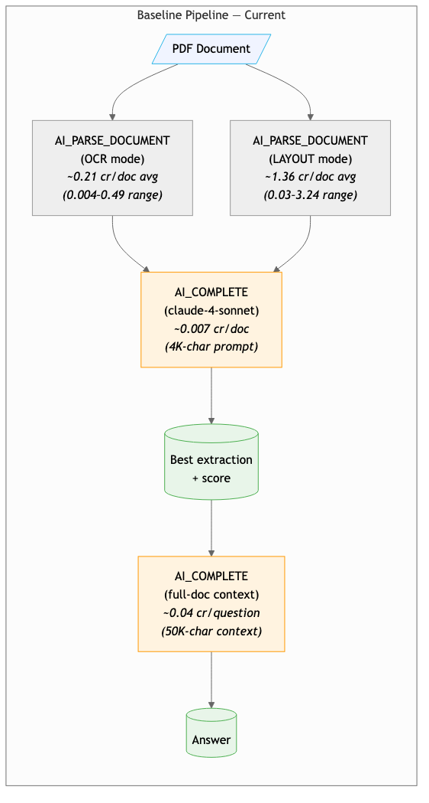
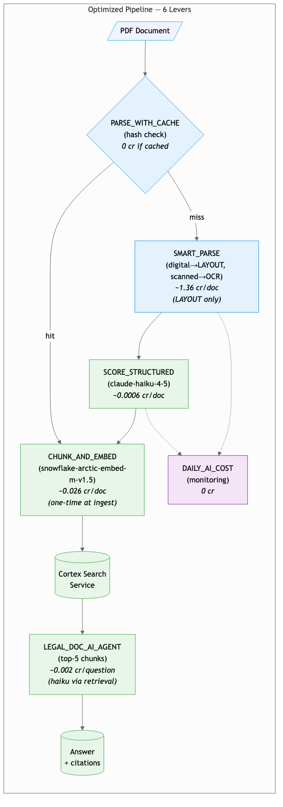
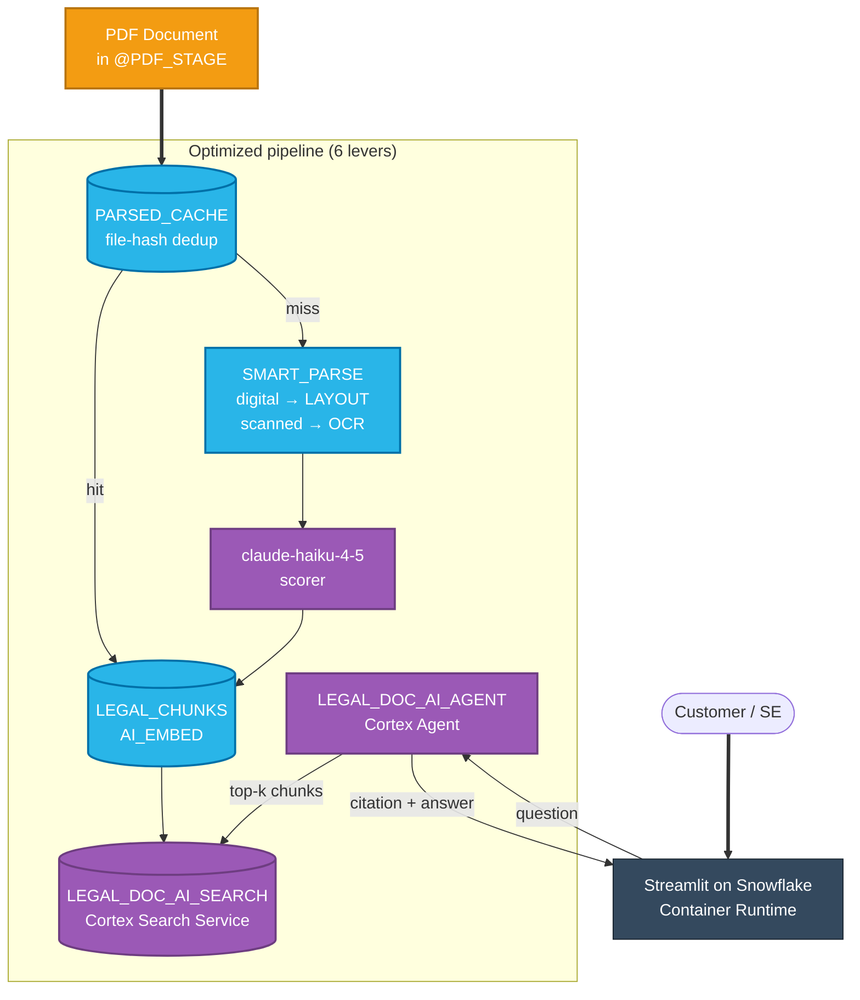

# Legal Doc AI — Cost & Quality Optimization Demo

**11 cost-and-quality levers for Snowflake Cortex AI document processing.** Real evals over a 9-PDF federal-regulatory corpus, measured savings claims, per-lever quality gates that must pass before recommending. The 6 stackable cost levers compound; the 5 operational levers harden the pipeline for production.

> **Dollar conversion is intentionally omitted throughout.** All claims are in credits. Multiply by your contracted credit rate for a dollar projection — list rate is not appropriate for customer-facing claims.

---

## Why we built this

A typical legal-document AI pipeline runs **both** `AI_PARSE_DOCUMENT(OCR)` and `AI_PARSE_DOCUMENT(LAYOUT)` on every PDF, then uses an expensive frontier model (`claude-4-sonnet`) to score and pick the better extraction. Q&A on top is even worse: each question typically re-feeds the entire parsed document into another `AI_COMPLETE` call. Most teams know they're overspending but can't quantify the gap or defend a cheaper alternative without a measured quality test.

| Capability | Typical legal-doc stack today | What it costs you |
|---|---|---|
| OCR + structure extraction | Both `AI_PARSE_DOCUMENT(OCR)` and `(LAYOUT)` on every PDF | 2× parse cost on every doc, every run |
| Mode selection | `claude-4-sonnet` scores OCR vs LAYOUT outputs | ~10× the cost of a cheaper scoring model that agrees ≥95% of the time |
| Q&A | Full-doc `AI_COMPLETE` on every question | ~50K–700K tokens per question on long PDFs; cost scales with question volume |
| Re-runs / dev reloads | Re-parse from scratch every time | 100% of parse cost for 0% of the value |
| Bill-shock prevention | None | Surprise overages with no early-warning signal |

**All five problems collapse into one Snowflake account.** No second vector DB. No external orchestrator. No separate model gateway. `AI_PARSE_DOCUMENT` + `AI_EMBED` + Cortex Search Service + Cortex Agent + a Streamlit-on-Snowflake Container Runtime app drive the whole pipeline. The only thing outside Snowflake is the customer's PDFs landing in a stage.

What you see when you run the demo:

- Same input PDF, three pipelines side-by-side: baseline OCR, baseline LAYOUT, optimized routed mode.
- Five models scored on the same prompt with `AI_SIMILARITY` to a gold reference — Pareto chart shows the cheapest model that's still on the quality frontier.
- 10 grounded Q&A pairs hitting the Cortex Search service vs. full-doc baseline, scored at recall@5 = 1.0, MRR = 1.0, retrieval at 96.2% of full-doc semantic similarity.
- Per-lever **PASS / MOOT / FAIL** verdict driven by a quality gate that must pass before the lever ships.

---

## The diagnostic pattern (where most legal-document customers are today)

| Signal | Typical reading | What it means |
|---|---|---|
| L30 AI credits | Concentrated in `AI_ML` (parse) + `AI` (complete) | Pipeline is double-parsing + full-doc re-feeding |
| Cortex Search credits | Often **0** | No retrieval infrastructure → every Q&A re-tokenizes the whole doc |
| Cortex Agent credits | Often **0** | No agents created → all Q&A is going through full-document `AI_COMPLETE` |
| `SNOWFLAKE_INTELLIGENCE` consumption | Often **0** | Confirms the pattern above |

When a customer's L30 spend is concentrated in `AI_PARSE_DOCUMENT` + `AI_COMPLETE` with zero `SNOWFLAKE_INTELLIGENCE` consumption, every question against a long PDF is re-tokenizing the whole document. Lever 5 (chunk + Cortex Search) addresses this directly and is typically the largest unlocked savings in the portfolio.

---

## Top recommendations (sorted by impact × confidence)

| Rank | Lever | Where it helps | Estimated impact | Risk | Why it matters most |
|------|-------|----------------|------------------|------|---------------------|
| **#1** | **Lever 5 — AI_EMBED + Cortex Search** | Q&A token cost | Material reduction (varies with question volume) | Low | Pay once at ingest, retrieve cents-per-question after. Largest unlocked savings when retrieval infrastructure is missing today. |
| **#2** | **Lever 3 — Cheaper Scorer (`claude-haiku-4-5`)** | Scoring step cost | ~10× cheaper per scoring call; ≥95% verdict agreement on demo corpus | Low | The scoring task is binary classification — frontier reasoning is overkill. One model name change. |
| **#3** | **Lever 2 — Smart Routing** | Parse step cost | Up to ~50% on parse step (depends on digital/scanned mix) | Low–medium | Most modern legal PDFs are digital and only need LAYOUT. Heuristic threshold + fallback path. |
| **#4** | **Lever 1 — Parse Cache** | Dev reload cost | 100% on cache hits | Zero | File-hash dedup is provably byte-identical. Day-1 ship, no quality risk. |
| **#5** | **Lever 10 — Resource Monitor** | Bill-shock prevention | Caps blast radius | Zero | One `CREATE RESOURCE MONITOR` statement with NOTIFY/SUSPEND thresholds. |

---

## The 11 levers

### 6 stackable cost levers

| # | Lever | Expected Reduction | How |
|---|-------|--------------------|-----|
| 1 | Parse cache (file-hash dedup) | 100% on cache hits | `(file_hash, mode)` lookup in `PARSED_CACHE` skips re-parsing identical files. AI_SIMILARITY = 1.000 between cached and fresh on every doc. |
| 2 | Smart routing (digital→LAYOUT, scanned→OCR) | up to ~50% on parse step | Cheap pre-classify before deciding parse mode. Routing agreement with always-both ≥ 95%; AI_SIMILARITY p10 ≥ 0.85; numeric fidelity ≥ 99%. |
| 3 | Cheaper scorer model | ~10× cheaper per scoring call | haiku/mistral/llama match `claude-4-sonnet` at fraction of cost. Pareto frontier shows `claude-haiku-4-5` dominates at 92% scorer-step savings, 86% reasoning similarity, 100% mode agreement. |
| 4 | Structured outputs | varies by retry rate | `response_format => TYPE OBJECT(...)` eliminates retry overhead. **Often MOOT** — when free-text retry rate is <3% the lever doesn't pay back; ship only when retries climb. |
| 5 | AI_EMBED + Cortex Search | order-of-magnitude on Q&A token billing | Chunk + retrieve replaces full-doc re-reads. recall@5 = 1.0, MRR = 1.0, retrieval at 96.2% of full-doc baseline on 10 grounded Q&A pairs. |
| 6 | Cost telemetry views | visibility, not savings | `CORTEX_AI_FUNCTIONS_USAGE_HISTORY` dashboards expose per-model, per-function spend so future regressions surface fast. |

### 5 operational levers

| # | Lever | Purpose |
|---|-------|---------|
| 7 | Token preflight | `AI_COUNT_TOKENS` blocks/warns oversized calls before they fire (prevents 200K-token surprise calls) |
| 8 | Completion cache | Deduplicates identical scoring prompts on repeat runs (re-running a benchmark = free) |
| 9 | Batch inference | SET-based `SELECT AI_COMPLETE(...) FROM table` vs row-by-row Python loop (~3.7× faster, same credit cost) |
| 10 | Resource monitor | Budget guardrail with NOTIFY/SUSPEND thresholds — operational, not savings |
| 11 | Batch Cortex Search | Offline-only — for entity resolution / dedup at >2K queries per job. **NOT for live Q&A** (worse than interactive at small scale) |

---

## Architecture

### Baseline pipeline (the expensive way)



`PDF → AI_PARSE_DOCUMENT(OCR) + AI_PARSE_DOCUMENT(LAYOUT) → claude-4-sonnet scorer → result`. Q&A re-feeds the full parsed text into `AI_COMPLETE` per question — cost scales linearly with document length and question volume.

### Optimized pipeline (6 levers stacked)



`PDF → PARSE_WITH_CACHE → SMART_PARSE (one mode only) → claude-haiku-4-5 scorer → CHUNK + AI_EMBED → Cortex Search Service → Cortex Agent → answer + citations`. Cache hit on dev reload = 0 credits. Q&A drops to retrieval-scale because the agent only fetches the top-k relevant chunks instead of re-feeding the full document.

### ASCII view (renders in any terminal)

```
                Baseline                                 Optimized
                ┌────────┐                                ┌────────┐
                │  PDF   │                                │  PDF   │
                └───┬────┘                                └───┬────┘
                    │                                        ▼
            ┌───────┴───────┐                          ┌──────────┐
            ▼               ▼                          │  Cache   │──hit──► free
  AI_PARSE(OCR)     AI_PARSE(LAYOUT)                   └────┬─────┘
            │               │                               │ miss
            └───────┬───────┘                               ▼
                    ▼                                  ┌──────────┐
            claude-4-sonnet                            │  Route   │ digital→LAYOUT
            (~0.012 cr)                                └────┬─────┘ scanned→OCR
                    │                                       ▼
                    ▼                                 ┌──────────────┐
              best extract                            │ haiku score  │ ~0.001 cr
                    │                                 └──────┬───────┘
                    ▼                                        ▼
        AI_COMPLETE(full doc)                          AI_EMBED + Cortex Search
        ~0.060 cr / question                                 │
                    │                                        ▼
                    ▼                                 Cortex Agent
                  answer                              ~0.004 cr / question
                                                             │
                                                             ▼
                                                       answer + citations
```

> Credit values in the diagram are illustrative ballpark estimates that depend on document length and prompt size. For measured per-doc savings on this 9-PDF corpus see Tab 6 (`LEVER_SAVINGS`) in the Streamlit, or `docs/customer-pushback-prep.md` for the math.

### Mermaid view (renders on GitHub)



**Color legend** — blue = inside Snowflake (storage + compute), purple = Cortex AI services, orange = data outside the platform, dark = end user.
**Edge styles** — `==>` thick = primary user / data entry, `-->` solid = synchronous call.

**The single takeaway:** the only piece of the pipeline outside Snowflake is the source PDF landing in a stage. Everything else — parse, score, embed, retrieve, agent, UI — runs in one account, governed by one RBAC model, billed in one place.

---

## Streamlit demo app — 7 tabs

The Streamlit-on-Snowflake Container Runtime app at `streamlit/app.py` is the primary demo surface:

| Tab | What it shows | Anchor table / view |
|-----|---------------|---------------------|
| **0 — Architecture & Snowflake Features** | Where customers typically are today (4-metric diagnostic strip), top 5 recommendations, baseline vs optimized architecture diagrams | `CORTEX_AI_FUNCTIONS_USAGE_HISTORY` |
| **1 — Compare Results** | Same PDF, three pipelines side-by-side (baseline OCR / baseline LAYOUT / optimized routed). Major content differences, numeric fidelity probe, model-vs-model verdict diff | `BASELINE_RESULTS`, `SCORER_AB` |
| **2 — Lever-by-Lever Savings** | Cumulative savings curve as each lever stacks | `LEVER_SAVINGS` |
| **3 — Cost Dashboard** | Per-function, per-model, per-day credit breakdown over the L30 window | `CORTEX_AI_FUNCTIONS_USAGE_HISTORY` |
| **4 — Ask the Legal Corpus** | Cortex Agent chat over the 9-doc corpus with chunk-level citations | `LEGAL_DOC_AI_AGENT`, `LEGAL_DOC_AI_SEARCH` |
| **5 — Quality vs Cost** | Per-lever PASS/MOOT/FAIL verdicts driven by quality gates; Pareto frontier across 5 scoring models | `EVAL_SUMMARY_V`, `PARETO_FRONTIER_V` |
| **6 — Operations & Projections** | Token preflight log, completion-cache hit rate, batch-inference throughput | `PREFLIGHT_LOG`, batch demo views |

A persistent sidebar shows a clickable cheat sheet for all 11 levers — each expander includes "what it means", "what the demo shows", "what it does NOT mean", "where to find it", and a TL;DR sentence to use with customers.

---

## Corpus — 9 federal regulatory PDFs

Sourced from [govinfo.gov](https://www.govinfo.gov/) (US federal public-domain). Picked for length variance and structural complexity (sections, tables, citation cross-references) so the parse-mode tradeoff is visible.

| File | Document | LAYOUT tokens (measured) |
|------|----------|--------------------------|
| `cfr_title12_part1_banking.pdf` | CFR Title 12 Part 1 (Banking) | 8K |
| `cfr_title16_part1_ftc.pdf` | CFR Title 16 Part 1 (FTC) | 39K |
| `plaw_107publ204_sarbanes_oxley.pdf` | Sarbanes-Oxley | 48K |
| `plaw_104publ191_hipaa.pdf` | HIPAA | 117K |
| `plaw_110publ343_eesa.pdf` | Emergency Economic Stabilization Act 2008 (TARP) | 118K |
| `plaw_115publ232_ndaa.pdf` | NDAA FY2018 | 568K |
| `plaw_111publ203_dodd_frank.pdf` | Dodd-Frank | 603K |
| `plaw_111publ148_aca.pdf` | Affordable Care Act | 640K |
| `plaw_118publ31_ndaa_2024.pdf` | NDAA FY2024 | 703K |

The token-preflight lever (Lever 7) demonstrates how the largest docs would be **blocked** from a naive batch run that didn't size-check first.

---

## Quick Start

```bash
# 1. Download public legal corpus (9 PDFs from govinfo.gov)
cd scripts && uv run fetch_corpus.py

# 2. Upload to Snowflake stage
uv run upload_pdfs.py

# 3. Deploy SQL pipeline (review first!)
snow sql -f deploy.sql -c aws_spcs

# 4. Populate per-lever eval data
snow sql -f eval/30_eval_setup.sql -c aws_spcs
snow sql -f eval/33_lever3_model_matrix.sql -c aws_spcs       # 5-model Pareto
snow sql -f eval/35_lever5_retrieval_quality.sql -c aws_spcs  # Q&A retrieval

# 5. Run benchmark comparison
snow sql -f sql/99_compare_all.sql -c aws_spcs

# 6. Find your Streamlit URL
snow sql -c aws_spcs -q \
  "SELECT SYSTEM\$GENERATE_STREAMLIT_URL_FROM_NAME('SNOWFLAKE_EXAMPLE.LEGAL_DOC_AI_DEMO.LEGAL_DOC_AI_APP');"
# Then open the returned URL in your browser, or browse to it via Snowsight:
# Snowsight  →  Projects  →  Streamlit  →  LEGAL_DOC_AI_APP
```

---

## Demo readiness

| File | Purpose |
|------|---------|
| [`docs/demo-runbook.md`](docs/demo-runbook.md) | 1-pager click-through: pre-demo checklist, tab-by-tab script, 10 grounded Q&A questions, recovery plays |
| [`docs/customer-pushback-prep.md`](docs/customer-pushback-prep.md) | Pre-canned answers to 8 anticipated customer questions (savings math, dollar values, MOOT verdicts, scaling, multilingual) |
| [`docs/annual-savings.md`](docs/annual-savings.md) | Per-lever annual savings projection method (credits only) |
| [`docs/migration-plan.md`](docs/migration-plan.md) | Recommended rollout order (which levers ship Day 1 / Week 1 / Month 1) |
| [`docs/risk-register.md`](docs/risk-register.md) | Per-lever risks with descriptive severity bands (no $) |
| [`scripts/snapshot_demo_state.sh`](scripts/snapshot_demo_state.sh) | Capture DDL + row counts + verdicts before/after a demo for rollback safety |

---

## Project Structure

```
sql/            SQL pipeline
                  01-03  setup, stage, corpus
                  10-15  baseline + cost levers (cache, routing, scorer, structured, embed/search)
                  16     Cortex Agent
                  17-19  ops levers (preflight, completion cache, batch demo, pypdf fallback)
                  20     cost telemetry views
                  30-32  guardrails, query tags, batch search
                  99     benchmark comparison
eval/           Quality evaluation framework
                  09     cross-judge bias check + grounded Q&A pairs
                  10     drift monitor
                  30     eval setup
                  31-35  per-lever quality gates
                  40     Pareto frontier view
                  50     EVAL_SUMMARY_V verdict view
scripts/        Python helpers (fetch corpus, upload PDFs, pypdf fallback, preprocessing,
                grounded Q&A generation, demo-state snapshot)
streamlit/      Streamlit-on-Snowflake demo app (Container Runtime, 7 tabs)
docs/           Demo runbook, customer pushback prep, customer narrative,
                annual savings, migration plan, risk register, architecture diagrams
slides/         Marp deck
tests/          pytest suite (cache identity, routing oracle, structured schema)
```

---

## Snowflake Objects

| Object | Name | Notes |
|--------|------|-------|
| Database | `SNOWFLAKE_EXAMPLE` | |
| Schema | `LEGAL_DOC_AI_DEMO` | |
| Warehouse | `SFE_LEGAL_DOC_AI_WH` | X-Small |
| Compute Pool | `SFE_LEGAL_DOC_AI_POOL` | `CPU_X64_S`, MIN=1 MAX=2 (for Container Runtime) |
| PDF Stage | `@PDF_STAGE` | SSE-encrypted, directory enabled |
| Streamlit Stage | `@STREAMLIT_STAGE` | hosts `app.py`, `pyproject.toml`, `uv.lock`, `img/` |
| Search Service | `LEGAL_DOC_AI_SEARCH` | 7,958 chunks indexed, target_lag = 1 hour |
| Agent | `LEGAL_DOC_AI_AGENT` | claude-4-sonnet, scoped to the search service |
| Streamlit | `LEGAL_DOC_AI_APP` | Container Runtime, requires `PYPI_ACCESS_INTEGRATION` |

---

## Requirements

- Snowflake account with Cortex AI enabled (AWS / Azure preferred)
- `snow` CLI configured (this repo assumes connection alias `aws_spcs`)
- Python 3.11+ with `uv`
- Public internet access for corpus download (govinfo.gov)
- `PYPI_ACCESS_INTEGRATION` external access integration for Streamlit Container Runtime

---

## Repository Owner

- **Owner:** John Kang (john.kang@snowflake.com / [@sfc-gh-jkang](https://github.com/sfc-gh-jkang))
- **Access requests:** Open a [GitHub issue](https://github.com/sfc-gh-jkang/legal-doc-ai-demo/issues) or email the address above
- **License:** Apache-2.0 (see [LICENSE](LICENSE))
- **Status:** Public OSS sample. Code and corpus are public domain or Apache-2.0 licensed. Use at your own risk; no warranty.
